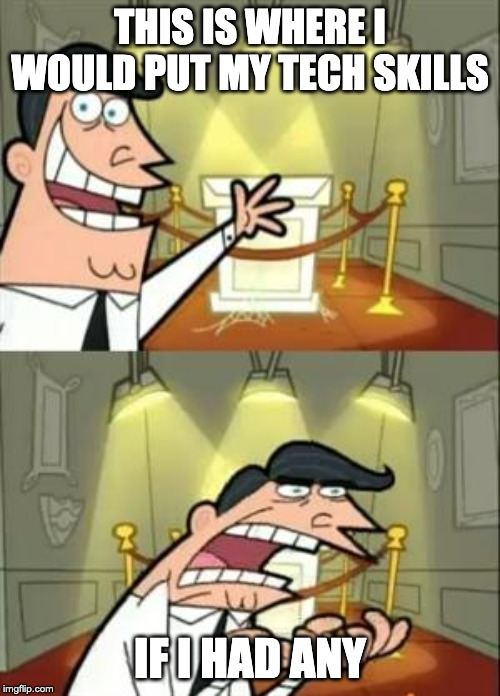

<h1> MyTechSkills </h1>
Hi, I'm Colin Morgan; I am a MAcc student at the University of Tulsa. Here is a list of my technical skills!

<h3> Technical Skills </h3>

GitHub Learning Lab

  
Below are courses I have completed on lab.github.com/courses:
 
<h4> Courses </h4>
<ol>
  <li> First Day on GitHub </li>
  <li> First Week on Github </li>
</ol>
 

Power BI + Dashboard

 
This is where I will put my skills learned in Power BI and the accompanying dashboard
 
 

Linux

 
[Insert skills here]
 
 

VPN

 
[Insert skills here]
 
 

PowerShell 5

 
[Insert skills here]
 
 

Trailhead Salesforce

 
[Insert skills here]
 
 

 
<h3> Fin </h3>
