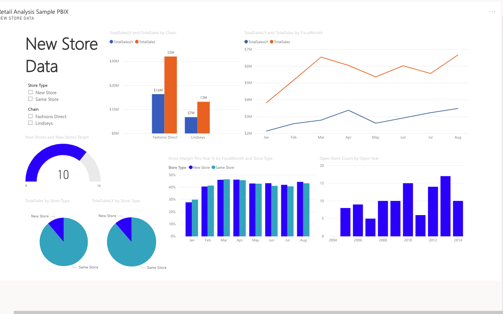
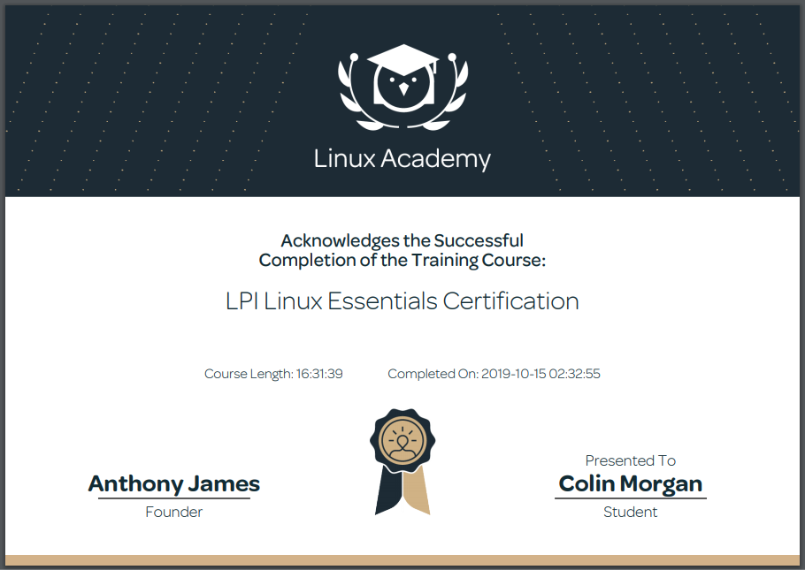
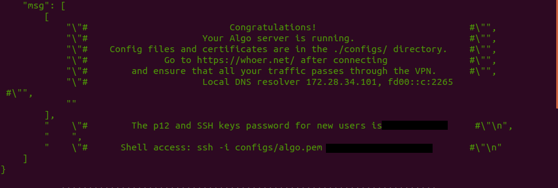
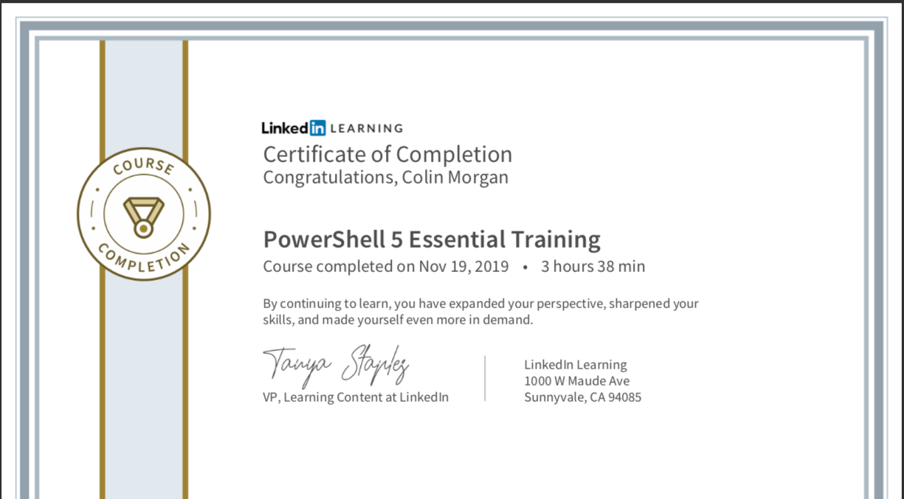
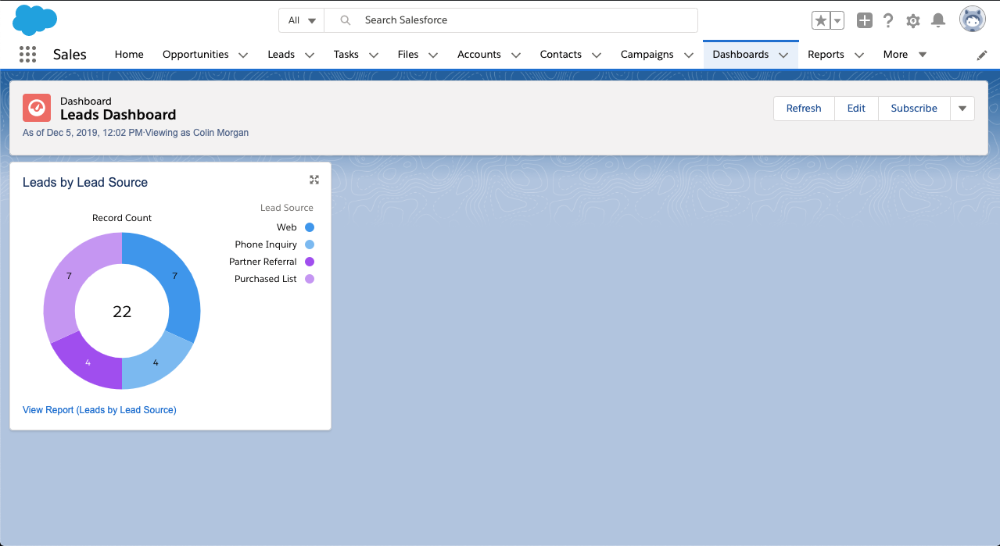

<h1> MyTechSkills </h1>
Hi, I'm Colin Morgan; I am a MAcc student at the University of Tulsa. Here is a list of my technical skills!

<h3> Technical Skills </h3>

GitHub Learning Lab

  
Below are courses I have completed on lab.github.com/courses:
 
<h4> Courses </h4>
  <ul>
    <li> First Day on GitHub </li>
    <li> First Week on Github </li>
    <li>Through these trainings, I learned how to create my own webpage on GitHub and make it viewable to the public. I also learned how to navigate the GitHub workflow which took a bit of practice. I worked on creating, reviewing, and accepting pull requests as well as managing and resolving merge conflicts.</li>
  </ul>
  
  
 

Power BI + Dashboard

 
<ul>
  <li> I completed the course Analyzing and Visualizing Data with Power BI on edX.org (below is the course overview). By completing this course, I learned how to upload and manipulate data, define relationships of data and edit queries. I also learned to connect to external data from sources like SQL on Azure.</li>
  </ul>

 <ul>
   <li>This training culminated with me creating a custom dashboard from a set of assigned data. This dashboard was then shared to be used on various platforms. From this course, I gained an overall understanding of how to manipulate and vizualize data for the purpose of creating an effective and efficient dashboard.</li>
   <li> <a href="https://youtu.be/HLRVrwNOCmI">Dashboard Video </a>  </li>
  </ul>

 
 

Linux

 
  <ul>
  <li> On LinuxAcademy.com, I completed the course LPI Linux Essentials course. Through this course I learned the basics of the Linux comamnd lines including beginner commands along with their respective tacs, commands to change directories and modify files, commands to view system information, and commands to view and alter users and groups along with permissions. </li>
  <li>Also on Linux, I used Virtual Box and Ubuntu to create my own VPN using Algo VPN scripts. I followed a tuturoial provided by trailofbits on GitHub. Through the tutorial provided, I was able to deploy an Algo server, configure VPN clients, create/delete users, and set up a tunnel by using WireGaurd.</li>
  </ul>

   
  
 
 

Amazon Web Services

 
  <ul>
    <li>I completed the AWS Essentials training course on LinuxAcademy.com. I Learned the basics of Amazon Management Console, Identity and Access Management (IAM), Virtual Private Cloud, Elastic Cloud Compute, Simple Storage Service, Simple Notification System, CloudWatch and CloudTrail management tools, and serverless computing.</li>
    <li>I used <a href="https://aws.amazon.com/blogs/awsmarketplace/setting-up-openvpn-access-server-in-amazon-vpc/">this</a> tutorial to setup a VPN through AWS. Through the AWS EC2 Management Console, I installed an OpenVPN Access Server. I then configured the server with various secruity settings, established an elastic IP address, and instituted an SSH connection through my local terminal. I had to make adjustments to the Key Pair permissions using the command line on my local terminal in order to properly connect to the OpenVPN server. Next, to test the server, I openned the server in my web browser to update a few settings and add users. Lastly, I connected to the VPN using the OpenVPN Connect client. </li>
  </ul>
  
 
 

PowerShell

 
  <ul>
    <li>By completing the PowerShell 5 Essential training through LinkedIn Learning, I gained an understanding of how to run various commands called cmdlets. Many of these commands were centered around being run as an administrator to access and automate Windows features. The get-help command was one of the most useful commands which showed proper syntax for various commands. </li>
  </ul>
  
 
 

Trailhead Salesforce

 
  <ul>
    <li>I completed the Trailhead Salesforce Admin Beginner cource which introduced me to the basics of the platform. Salesforce is useful for managing lead and customer data. I learned to effectively model data, create and customize the Lightning app, personalize the mobile app experience, and visualize data by creating reports and dashboards. See examples below.</li>
  </ul>
  
  
 
 

